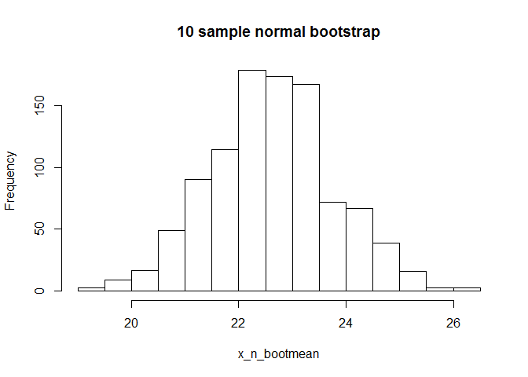

# Unit 4 homework
Alex Deshowitz  
May 30, 2016  
#### This Markdown File will illustrate the central limit theorem at work via bootstrapping

###### The central limit theorem states that as we sample more and more, the distribution of the sample means approaches that of a normal distribution.  We can think of it as looking at the probabilities of certain combinations happening multiple times becoming more scarce.  This applies to both normally distributed samples and non-normal samples.

* First, let's create 4 random samples, 2 of a normal distribution and 2 from exponential distributions


```r
x_n<- rnorm(10,22,5)
y_n<- rnorm(60,22,5)

x_e<- rexp(10,1)
y_e<- rexp(60,1)
```

* Now, we have 4 random samples "n" samples are normal distributions and "e" samples are exponential
* Let's look at the data


```r
hist(x_n, main = "10 sample normal")
```

<!-- -->

```r
hist(y_n, main = "60 sample normal")
```

<!-- -->

```r
hist(x_e, main = "10 sample exponential")
```

<!-- -->

```r
hist(y_e, main = "60 sample exponential")
```

<!-- -->

* It looks like our smaller (10 sample size) do not necessarily match the distributions we would expect, so let's bootstrap everything.  Also, notice that the exponential distributions do resemble what we would expect this type of distribution to look like

* For reference let's look at the means of the data


```r
x_n_mean<- mean(x_n)
x_n_mean
```

```
## [1] 22.66101
```

```r
y_n_mean<- mean(y_n)
y_n_mean
```

```
## [1] 22.80392
```

```r
x_e_mean<- mean(x_e)
x_e_mean
```

```
## [1] 1.026376
```

```r
y_e_mean<- mean(y_e)
y_e_mean
```

```
## [1] 0.8511686
```

* Now for the bootstrap, we will run 1000 samples for everything
* Notice that we setup a resultset for each set of sample means for both normal and exponential distributions

```r
s<- 1000
x_n_bootmean<- numeric(s)
y_n_bootmean<- numeric(s)

x_e_bootmean<- numeric(s)
y_e_bootmean<- numeric(s)

#normal 10 sample
for (i in 1:length(x_n_bootmean)){
  x_n_bootsample<- sample(x_n, size = length(x_n), replace = TRUE)
  
  x_n_bootmean[i]<- mean(x_n_bootsample)
}
#normal 60 sample
for (i in 1:length(y_n_bootmean)){
  y_n_bootsample<- sample(y_n, size = length(y_n), replace = TRUE)
  
  y_n_bootmean[i]<- mean(y_n_bootsample)
}

#exponential 10 sample
for (i in 1:length(x_e_bootmean)){
  x_e_bootsample<- sample(x_e, size = length(x_e), replace = TRUE)
  
  x_e_bootmean[i]<- mean(x_e_bootsample)
}
#exponential 60 sample
for (i in 1:length(y_e_bootmean)){
  y_e_bootsample<- sample(y_e, size = length(y_e), replace = TRUE)
  
  y_e_bootmean[i]<- mean(y_e_bootsample)
}
```

* Now, let's look at the distributions of our bootstrapped means to see if the central limit theorem holds true

```r
hist(x_n_bootmean, main = "10 sample normal bootstrap")
```

<!-- -->

* See, now our 10 sample size distribution looks more normal, subject to change, but my result had a left skew


```r
hist(y_n_bootmean, main = "60 sample normal bootstrap")
```

<!-- -->

* More normal than before, although with an n=60 we looked pretty good from the start


```r
hist(x_e_bootmean, main = "10 sample exponential bootstrap")
```

<!-- -->

* But wait!  We wanted an exponential distribution!  Yes, but remember what the CLT says!  This is exactly what we would expect.  As we sampled from the smaller exponential our data became normally distributed due to the probability of generating more obscure/less likely samples!


```r
hist(y_e_bootmean, main = "60 sample exponential bootstrap")
```

<!-- -->

* The same goes for this set of data.  We have illustrated the central limit theorem via bootstrapping.


